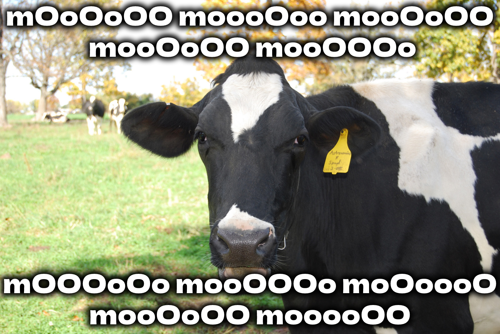
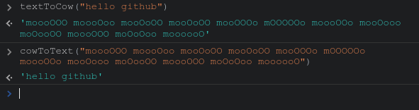

# CowTranslator.js 🐄

JavaScript library to translate cow language 🐄 to text

# Usage 📝

This library provices 2 functions:
- `cowToText` : translate cow language to text
- `textToCow` : translate text to cow language

# final

If you have any problem, don't hesitate to open an issue

# contributing

Pull requests are welcome. For major changes, please open an issue first to discuss what you would like to change.

