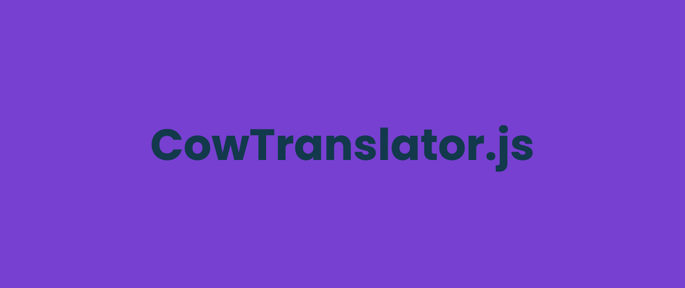

# CowTranslator.js 🐄

JavaScript library to translate cow language 🐄 to text



# jsDelivr 

```html
<script src="https://cdn.jsdelivr.net/gh/SkwalExe/cowTranslator.js@v1.1.0/dist/cow-translator.min.js"></script>
```

# NPM module 

Install the npm module 

```bash
npm install cow-translator
```

And import it in your project 

```js
const cowTranslator = require('cow-translator');
```

# Setting up 

You can import the library into you website with [JsDelivr](#JsDelivr) or, you can use the [npm module](#NPM-module) and import it in your project.

# Usage 📝

This library provides 2 functions:
- `cowTranslator.cowToText` : translate cow language to text
- `cowTranslator.textToCow` : translate text to cow language

Each of these functions returns a translationResult class : 

- `translationResult.text` : the human version
- `translationResult.cow` : the cow version
- `translationResult.error` : the error message if any
- `translationResult.success` : whether the translation was successful or not
- `translationResult.warning` : whether warnings were generated or not

## Human to cow

**Translate Hello World ! to cow language**

```js
let cow = cowTranslator.textToCow("Hello world !");
```

`.cow` is the cow version of the text

```js
cow.cow // "mOoOoOO moooOoo mooOoOO mooOoOO mooOOOo mOOOOOo moOoOOo mooOOOo moOoooO mooOoOO mooooOO mOOOOOo MoooooO"
```

The translation is successful

```js
cow.success // true
```

## Cow to human

**Translate `"mOoOoOO moooOoo mooOoOO mooOoOO mooOOOo mOOOOOo"` to human language**

```js
let human = cowTranslator.cowToText("mOoOoOO moooOoo mooOoOO mooOoOO mooOOOo mOOOOOo");
```

`.text` is the human version

```js
human.text // "Hello"
```

## Errors and warnings

If an error occured and the translation was not successful, the following properties are set:

- `translationResult.success` : ⛔ false
- `translationResult.error` : the error message
  
If warnings were generated, the following properties are set:

- `translationResult.warning` : ⚠️ true
- `translationResult.error` : the warning message
- `translationResult.success` : ✅ true


# final

If you have any problem, don't hesitate to open an issue

# Contributing

1. Start by [**forking** this repository](https://github.com/SkwalExe/cowTranslator.js/fork)

2. Then clone your fork to your local machine.
  ```git
  git clone https://github.com/your-username/cowTranslator.js.git
  ```

3. Install dev dependencies
```npm
npm install --save-dev
```

4. Create a new branch
  ```git
  git checkout -b super-cool-feature
  ```

5. Then make your changes

6. Update the changelog and version number if needed (using [Semantic Versioning](https://semver.org)) 
  ```bash
  # bug fix
  npm version patch --no-git-tag-version

  # add a new feature 
  npm version minor --no-git-tag-version
  
  # changes that break backwards compatibility
  npm version major --no-git-tag-version
  ```

7. List and correct linting errors
  ```bash
  npm run lint
  ```

8. Update the minified/browser version of the library
  ```bash
  npm run build
  ```


9. Once you're done, commit your changes and push them to the remote repository.
  ```git
  git add --all
  git commit -m "Add super-cool-feature"
  git push origin super-cool-feature
  ```

10. Then, open a pull request on GitHub from your fork.
    1. Go to [this link](https://github.com/SkwalExe/cowTranslator.js/compare/)
    2. Click compare across forks
    3. On the right, on `head repository` select your fork
    4. And on `compare` select the branch you just created
    5. Click on `Create Pull Request` and submit your pull request

<a href="https://github.com/SkwalExe#ukraine"></a>